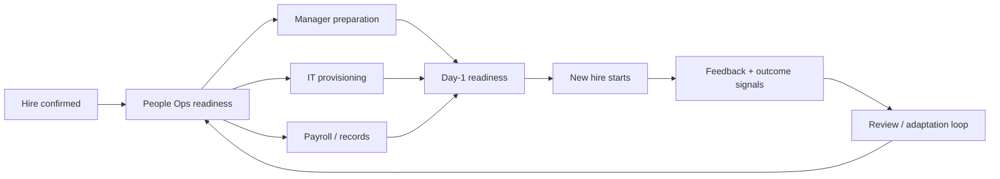

# Example: Adaptive Employee Onboarding System

## Purpose
Create a repeatable onboarding system that gets employees productive, compliant, equipped, and connected by Day 1 while detecting and correcting recurring breakdowns over time.

## Desired outcomes
- required access/equipment ready before start;
- payroll/employee records correct;
- manager preparation complete;
- new hire knows where to start and who owns support;
- exceptions are visible and recovered, not silently lost.

## Core flow

## Operating signals
| Signal | Healthy expectation | Why it matters |
|---|---|---|
| readiness by T-1 day | critical tasks complete | predicts Day-1 experience |
| late manager submissions | low/stable | exposes upstream ownership failure |
| IT exception rate | low/stable | reveals provisioning fragility |
| payroll corrections after start | near zero | detects record-quality failure |
| new-hire Day-1 blockers | low | outcome-oriented validation |

## Bounded healing
### Automatic / operational
- reassign an overdue low-risk task to the documented backup owner;
- send bounded reminders/escalations;
- reopen a failed provisioning task without duplicating completed work;
- route exceptional cases into a visible exception queue.

### Human-authorized
- override identity/employment data;
- change compensation or contractual information;
- waive a mandatory compliance control;
- alter ownership, policy, or approval rules.

## Learning example
Observed pattern: laptop readiness falls for employees whose managers submit details less than three business days before start.

Diagnosis: the problem is not the laptop vendor; it is an upstream handoff constraint.

Treatment:
1. move manager-input deadline earlier;
2. add a T-5 readiness signal;
3. create an exception path for late hires;
4. measure whether late provisioning decreases;
5. keep the change only if the system outcome improves without creating disproportionate manager burden.

The system heals operationally through bounded recovery, but structural changes re-enter the system-design and validation process.
