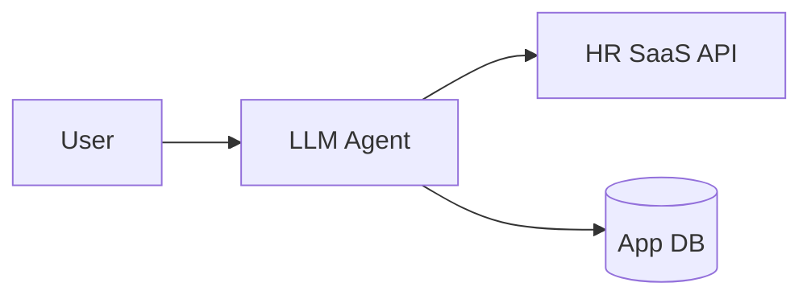
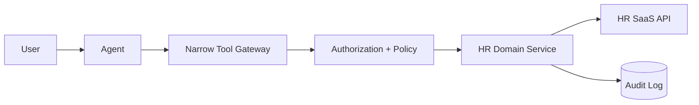

# Example: Existing Agent With Direct SaaS Writes

## As-is

## Finding
**Critical:** the same agent that interprets untrusted natural-language input also holds broad credentials capable of mutating sensitive HR records.

## Target

## Migration
1. Inventory actual write operations used by the agent.
2. Replace generic API access with one narrow tool per approved operation.
3. Move validation/business invariants into domain service.
4. Scope service credentials to required actions.
5. Add idempotency + audit to side-effecting writes.
6. Require approval for the highest-impact operations.
7. Remove broad credential from agent runtime.

No full rewrite is necessary.
