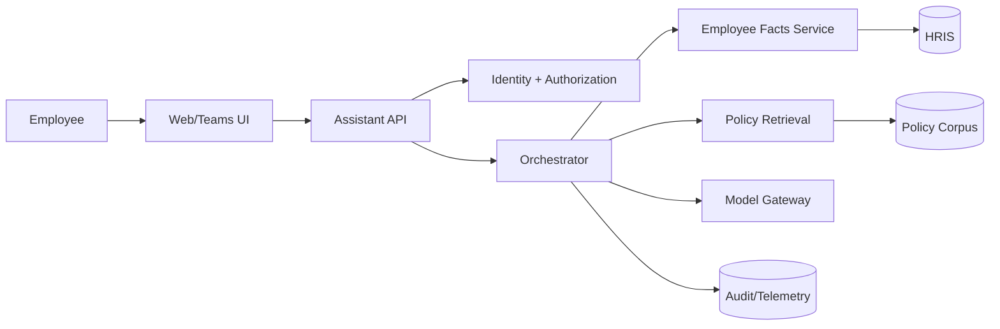

# Example: New AI HR Policy Assistant

## Executive summary
Build a read-first HR assistant that answers policy questions from authoritative policy content and structured employee attributes. The LLM explains and synthesizes; deterministic services retrieve employee facts and calculate entitlements. No direct model writes to HRIS in v1.

## Evidence ledger
**Observed:** Users need natural-language HR policy answers.

**Assumed:** Policies differ by country and employment type; HRIS has authoritative worker attributes.

**Proposed:** Hybrid architecture with deterministic lookup + grounded generation.

## Requirements
- Ask policy questions in natural language.
- Personalize answers using authorized worker attributes.
- Provide provenance to authoritative policy sources.
- Do not expose one employee's data to another.
- Escalate conflicting/insufficient evidence.

## Recommended architecture

## Critical flow
1. Authenticate user.
2. Resolve worker identity/authorization.
3. Retrieve only required worker attributes.
4. Retrieve policy passages filtered by jurisdiction/employment context.
5. Deterministically compute exact entitlement where rules are structured.
6. Ask model to explain using supplied evidence.
7. Validate structured response and attach provenance.
8. Escalate if evidence conflicts or is insufficient.

## Key trade-off
A direct “agent -> HRIS” design is simpler to prototype but creates an overly broad trust boundary. A narrow employee-facts service adds code but centralizes access control, field minimization, and audit.

## Architecture gate
**READY WITH ASSUMPTIONS** — proceed with a walking skeleton while validating policy-source ownership and employee-field authorization rules.
