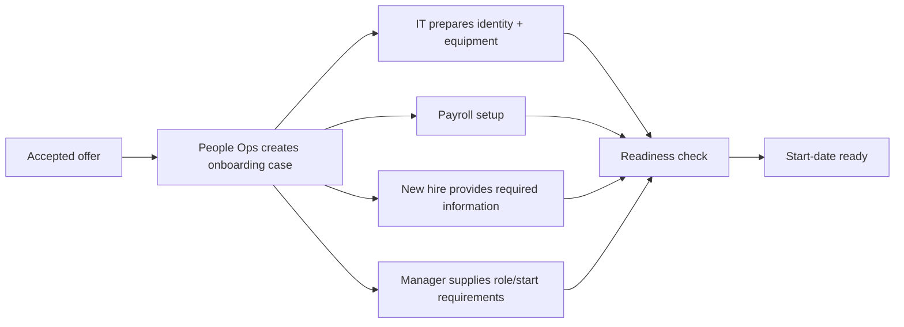

# Example: Employee Onboarding as a Business System

This example deliberately treats onboarding as an operating system, not primarily as a software project.

## Purpose
Enable every new hire to become legally, technically, operationally, and socially ready to work by the agreed start date with minimal manual chasing.

## Actors
- New hire
- Hiring manager
- People Operations
- IT
- Payroll
- Workplace / facilities where relevant

## System boundary
Inside: onboarding preparation from accepted offer through first-week readiness.

Outside: recruiting selection, long-term performance management, and vendor systems except where they interact with onboarding.

## Core flow

## Important state
A new-hire case has explicit readiness state rather than being tracked only in email:
- information complete
- compliance complete
- payroll ready
- equipment/access ready
- manager plan ready
- exceptions unresolved

## Decision rights
- People Ops owns onboarding-case coordination.
- Payroll owns payroll correctness.
- IT owns account/device readiness.
- Manager owns role-specific readiness and first-week plan.
- Exceptions have named escalation owners rather than being broadcast to everyone.

## Failure modes
- late manager input delays provisioning;
- missing employee documents block payroll/compliance;
- unclear ownership creates duplicate chasing;
- completion is reported despite one critical dependency remaining open;
- too many approvals increase lead time without reducing meaningful risk.

## Feedback and measurement
Measure outcomes rather than task completion alone:
- percentage fully ready by start date
- median time to resolve onboarding exceptions
- number of manual chase interactions per hire
- first-week access failures
- payroll setup defects
- new-hire/manager readiness feedback

## Design decision
Do not begin by buying or building an onboarding platform. First establish ownership, state, handoffs, exception rules, and readiness measures. Automate only the stable, repeatable portions afterward.

## Fitness check
Requirement: every critical readiness dependency must be visible before start date.

Mechanism: one shared case/readiness model with explicit dependency owners.

Verification: sample onboarding cases and confirm no critical dependency can be marked complete while an owned blocker remains open.

Pass condition: readiness status accurately reflects all critical dependencies.
