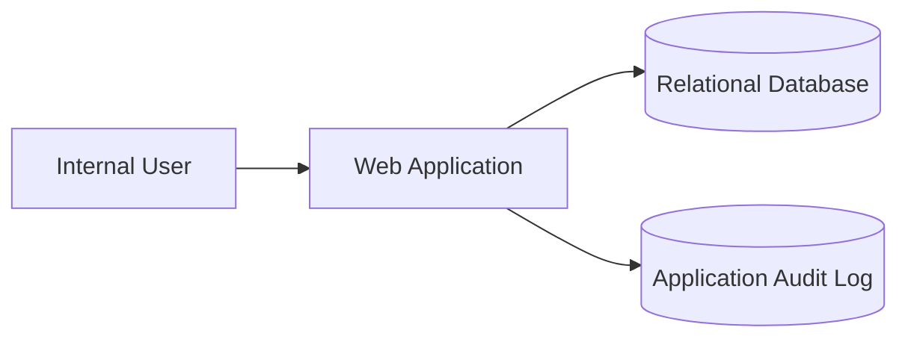

# Example: Simple Internal Equipment Tracker

## Decision
Use a single deployable web application with one relational database. Do not introduce microservices, Kafka, Kubernetes, a cache, an agent, or a vector database.

## Why
The workload is small, business-hour availability is acceptable, and none of those components solve a stated requirement. A modular monolith keeps deployment and transactions simple while preserving clean internal boundaries.

## Architecture

## Gate
**READY WITH ASSUMPTIONS** — verify SSO requirements and backup expectations during implementation.
