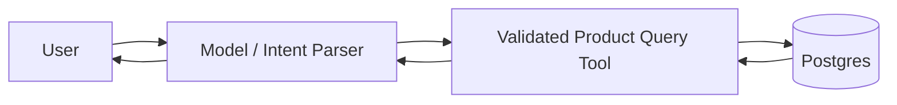

# Example: Structured Lookup Without RAG

## Requirement
Users ask natural-language questions about a small structured product catalog stored in Postgres; answers require exact filtered facts plus a friendly explanation.

## Decision
Translate intent into a validated structured query/tool call, fetch authoritative records from Postgres, then let the model explain the returned facts. Do not add embeddings or a vector database.

RAG would add indexing, synchronization, relevance tuning, and another failure mode without improving exact lookup for this requirement.
